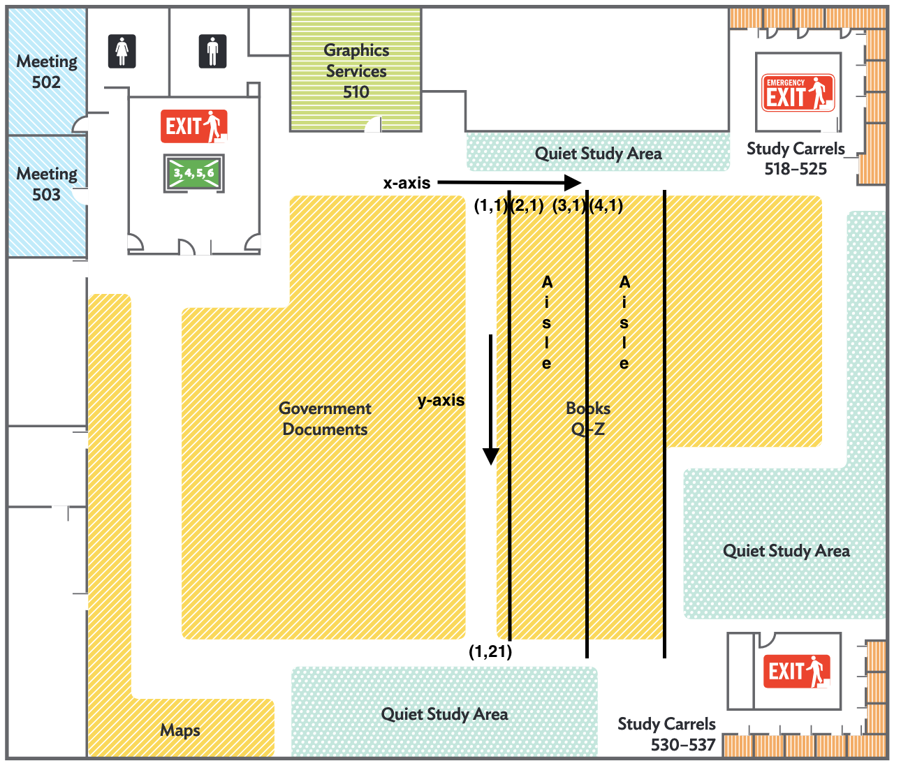

```{r setup, include=FALSE}
knitr::opts_chunk$set(echo = TRUE)
```

## Lab 3 Update

Here is the code for producing the samples. I bit the bullet and ranked every bookcase, it really was not very difficult or time consuming so no worries gang. You'll find the data in the attached file 'LibraryBookcaseRankings.csv'. We decided that for now we will have everyone in the group sample 1 bookcase from each strata, and to sample the books we will perform a 1 in 10 systematic sample.

```{r}
## Data input has all bookcases represented as x,y 
## coordinate pair, along with their strata assignment(rank)
## Rank 1 is for empty 
## Rank 2 is for low
## Rank 3 is for med
## Rank 4 is for high
BookcaseRankings<- read.csv('LibraryBookcaseRankings.csv')

## Subsetting the dataframe by ranking. 
Strata_1 = BookcaseRankings[BookcaseRankings$Rank == 1,]
Strata_2 = BookcaseRankings[BookcaseRankings$Rank == 2,]
Strata_3 = BookcaseRankings[BookcaseRankings$Rank == 3,]
Strata_4 = BookcaseRankings[BookcaseRankings$Rank == 4,]

## Setting Seed to reproduce samples
set.seed(1)
### Sampling relevant dataframes. 
## Pulling Index. 
Strata_2_SampleIndex <- sample(nrow(Strata_2), size = 3)
Strata_3_SampleIndex <- sample(nrow(Strata_3), size = 3)
Strata_4_SampleIndex <- sample(nrow(Strata_4), size = 3)
## Assigning Row Values.
Strata_2_Sample <- Strata_2[Strata_2_SampleIndex,]
Strata_3_Sample <- Strata_3[Strata_3_SampleIndex,]
Strata_4_Sample <- Strata_4[Strata_4_SampleIndex,]

Stefano <- rbind(Strata_2_Sample[1,],Strata_3_Sample[1,], Strata_4_Sample[1,] )
Emily <- rbind(Strata_2_Sample[2,],Strata_3_Sample[2,], Strata_4_Sample[2,] )
Thomas <- rbind(Strata_2_Sample[3,],Strata_3_Sample[3,], Strata_4_Sample[3,] )

Stefano 
Emily 
Thomas
```

# Instructions for Two Stage Cluster Sample

To find the bookcase you need to sample from follow the figure in this document.

```{r pressure, echo=FALSE, fig.cap="Coordinate System for Mapping Bookcases",fig.align="center",  out.width = '75%'}

```

Once you get to the bookcase count, conduct a one-in-10 systematic sample of the books, starting on the top shelf counting from left to right. How you randomize the one-in-10 is up to you. Record the page totals for each book included in the sample, as well as the total number of books in your bookcase to the shared google sheet.


# Computing the Estimator
Below is a function that computes the two-stage cluster sample total and varaince based on the unbiased total estimator. 

```{r}
TwoStageClusterSample <- function(N,M,y){
  ## This function takes a Total number of first stage clusters N(number of bookcases), 
  ## Population total inside the sampled second stage cluster M(Booktotal inside sampled bookcases), 
  ## and the second stage sample y, as a dataframe with books as rows and columns as bookcase samples. 
  
  ## Extracting number of samples n
  n = length(y) 
  ## Computing yHats for each sample
  yHats = colMeans(y, na.rm = TRUE);
  ## Computing the Tau estimator
  TauHat = N*sum(M*yHats)/n;
  ## Computing the variance for each sample
  s_squared = diag(var(y,  na.rm = TRUE))
  ## Pulling number of samples taken, at each bookcase. 
  m = colSums(!is.na(y))
  ## Computing the MSE
  MSE = sum((M*yHats - (TauHat/N))^2) / (n-1); 
  
  ## Computing The variance
  Cluster2ClusterVar = ((N-n)/N)*(N^2)*(MSE/n)
  InsideClusterVar = (1/(n*N))*(N^2)*sum(M^2*((M - m)/M)*(s_squared/m))
  TotalVar = Cluster2ClusterVar + InsideClusterVar
  
  # Returning the results as a list. 
  RList <- list('tHat' = TauHat, 's_squared' = TotalVar)
  return(RList)
}
```
This script reads the data from the SampledData.csv which contains data from our whole group and computes the total estimator. 
```{r}
################## READING IN DATA ##########################
SamplingData <- read.csv('SampledData.csv')
## Assigning Bookcase Totals
N <- c(nrow(Strata_2),nrow(Strata_3),nrow(Strata_4))  
## Assigning Book Totals 
M <- SamplingData[,1]
## Removing Bookcase Totals From DataFrame
SamplingData <- SamplingData[2:nrow(SamplingData),] 
## Subset by Strata
Strata_2_Data = SamplingData[,1:3]
Strata_3_Data = SamplingData[,4:6]
Strata_4_Data = SamplingData[,7:9]

################### COMPUTING ESTIMATOR ######################
## Compute 2-Stage Cluster Sample Estimators
TwoStage_2 <- TwoStageClusterSample(N[1], M[1:3], Strata_2_Data)
TwoStage_3 <- TwoStageClusterSample(N[2], M[4:6], Strata_3_Data)
TwoStage_4 <- TwoStageClusterSample(N[3], M[7:9], Strata_4_Data)

## Compute Stratified Estimator. 
Est.Tau <- sum(c(TwoStage_2$tHat, TwoStage_3$tHat, TwoStage_4$tHat))
Est.SE <- sqrt(sum(c(TwoStage_2$s_squared, TwoStage_3$s_squared, TwoStage_4$s_squared)))
CI95 <- c(Est.Tau + 2*Est.SE, Est.Tau - 2*Est.SE)

#> Est.Tau
#[1] 28160561
#> Est.SE
#[1] 6742945
#> CI95
#[1] 41646452 14674670
```
